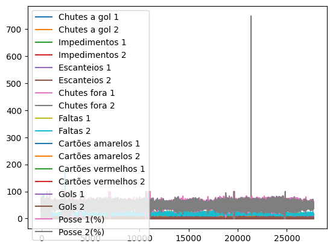
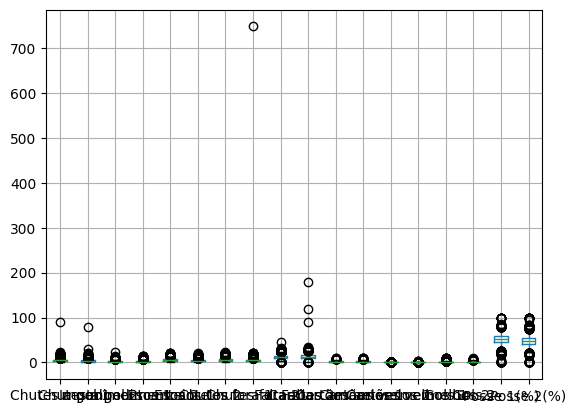
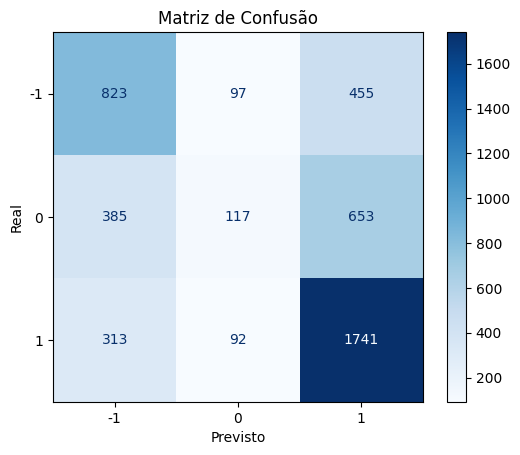
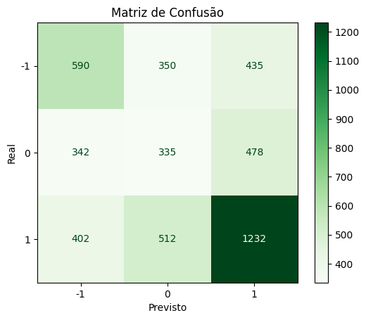
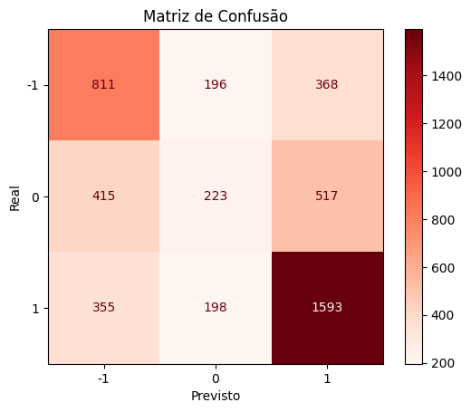

# KILO SQUAD - PS ANALYTICA
##  **ForecastFC: Modelo de Machine Learning para Previsão de Resultados Futebolísticos**
### Bibliotecas usadas
As bibliotecas utilizadas para a ánalise de dados foram a pandas para carregar e manipular os dados, numpy para fazer as operações matemáticas, matplotlib para a criação de gráficos e a seaborn para a visualização de dados estatísticos. 
```python
import pandas as pd
import numpy as np
import matplotlib.pyplot as plt
import seaborn as sns
```
Para o Aprendizado de Máquina, nós utilizamos três modelos e analisamos para saber qual teria o melhor resultado. As bibliotecas foram a  LogisticRegression, a DecisionTreeClassifier e a RandomForestClassifier.
```python
from sklearn.tree import DecisionTreeClassifier
from sklearn.linear_model import LogisticRegression
from sklearn.ensemble import RandomForestClassifier
```

Na etapa de pré processamento, nós utilizamos o train_test_split para a divisão de dados para treino e teste. Para a normalização dos dados, foi utilizado o MinMaxScaler. Além destes, a função LabelEncoder foi importante para conseguirmos fazer a conversão de classes categóricas em valores numéricos.

``` python
from sklearn.model_selection import train_test_split
from sklearn.preprocessing import MinMaxScaler, LabelEncoder
```


### Análise Exploratória dos Dados
Inicialmente fizemos a visualização dos nossos dados para entender as características do nosso dataframe. Para isso utilizamos a função head() do pandas para ter um olhar geral do nosso conjunto de dados, onde já era perceptível que teríamos que fazer o tratamento de dados NaN. Em seguida, fomos verificando as informações padrão de uma análise inicial, onde vimos a quantidade de linhas e colunas (shape) da nossa base de dados, algumas informações, como quantos valores não nulos tinham e o tipo de cada uma das variáveis.

O próximo passo foi identificar a quantidade de dados nulos por coluna, pois, como foi dito anteriormente, era algo que já sabíamos que precisaríamos tratar. Criamos “nulos_por_coluna = stats.isna().sum()”, variável que recebe a função que soma os valores nulos por coluna no dataframe e imprimimos esses valores. Com o resultado pôde-se perceber que havia muitos dados nulos na base de dados, onde de 27716 instâncias no dataframe, tínhamos variáveis com até 22697 dados nulos, o que possivelmente faria com que essas informações fossem menos relevantes para a previsão. Tiramos as linhas das categorias que possuíam poucos valores nulos e depois excluímos aquelas colunas que tinham menos de 15 mil valores não nulos, pois consideramos que seriam pouco relevantes para a análise já que teríamos pouco valores para utilizar.

Outros passos que fizemos e que achamos que seriam importantes para auxiliar posteriormente nos modelos preditivos foram criar uma coluna Resultado em que haveria os valores de vitória (1), empate (0) e derrota (-1) e fazer a conversão de classes categóricas em valores numéricos.

### Remoção de Outliers
Posteriormente fomos identificar se no conjunto de dados haviam outliers, onde, para isso isso plotamos alguns gráficos com stats_sem_nulos.plot() e stats_sem_nulos.boxplot(), que mostrava claramente alguns dados discrepantes em relação aos demais.





Então, observando esses gráficos, selecionamos aqueles onde visualmente os dados não condiziam com os demais dados e com as informações reais e possíveis de um jogo de futebol. Das variáveis que tinham essa característica, plotamos em um gráfico somente com elas, para olharmos mais de perto para certificar que elas eram as mesmas que iríamos retirar. Calculamos os valores máximo e mínimo para mensurar o quanto divergente estavam os dados e concluímos que algumas variáveis estavam com valores muito altos e que os menores valores não chegavam a ser negativos. Em seguida, plotamos um gráfico para cada coluna para poder determinar o valor de corte dos outliers e, com isso, criamos um filtro chamado bool_filtro, que aplicamos no nosso dataframe. Conseguimos verificar que saíram todos os outiliers verificando os valores máximos e olhando o gráfico das colunas.
### Criação de Features
Nessa etapa criamos uma função que recebe o nosso dataframe e cria algumas mais algumas features que correspondem às informações de jogo que temos e podem auxiliar em resultados melhores para o modelo. Dentre as features criadas, temos diferença de posse de bola, diferença de chutes a gol, diferença de finalizações totais (a gol + fora), diferença de cartões, adicionar chutes a gol, eficiência de chutes, índice de faltas, índice de eficiência ofensiva (chutes a gol / posse de bola).
### Modelos de Aprendizado de Máquina 
Primeiramente, separamos o dataframe em dados de de entrada (features, aqui definida pela variável X) que serão usadas para treinar o modelo, aqui removemos as colunas “Resultado”, “Gols 1” e “Gols 2”, pois elas determinam o resultado que queremos e eliminando elas evita o overfit. Depois separamos a parte somente para os resultados, que vai ser o que queremos prever, ou seja, variável alvo (target, aqui definida por Y).

O próximo passo é divisão dos nossos dado em treino e teste, onde no nosso código foi de 80% para treino e 20% para teste.


```python
X_treino, X_teste, Y_treino, Y_teste = train_test_split(X, Y, test_size=0.20, random_state=42)
```
Para fazer a normalização dos dados criamos um “scaler” com a função MinMaxScaler() para escalar os dados no intervalo de 0 a 1. Fizemos isso pois, para muitos modelos o funcionamento é melhor com os dados normalizados, então dessa forma aplicamos essa normalização para os dados de treino e teste.

Por fim, criamos um modelo e treinamos eles nos dados normalizados. Verificamos a resposta do modelo com base no que aprendeu em y_pred = LR.predict(X_teste_norma) e para entender como foi o resultado fizemos classification_report(Y_teste, y_pred) e imprimimos na tela. Com isso conseguimos ver a acurácia, precisão, recall, f1-score etc.
### Resultados

Dos modelos que treinamos, o de Regressão Logística obteve uma acurácia de 58%, onde apresentava uma precisão de 55%, 42% e 61% para derrota, empate e vitória, respectivamente; recall de 63%, 9% e 15% e f1-score de 59%, 15% e 70%.

O modelo de classificação Árvore de decisão obteve 47% de acurácia, 44%, 30% e 58% de precision; 45%, 29% e 57% de recall e 45%, 30% e 58% de f1-score.

O modelo de classificação Random Forest obteve 58% de acurácia, 53%, 40% e 65% de precision; 65%, 19% e 75% de recall e 58%, 26% e 70% de f1-score.


Lembrando que:
Precisão (Precision): "Das previsões positivas que o modelo fez, quantas eram realmente verdadeiras?"
Recall (Sensibilidade ou Revocação): "Dos casos positivos que realmente existem, quantos o modelo conseguiu identificar corretamente?"
F1-Score: Média harmónica da precisão e do recall, e fornece uma medida única que equilibra as duas métricas

Os resultados podem ser verificados também por meio da matriz de confusão, onde mostra o quanto o modelo previsto foi o mesmo do modelo real e quanto errou para as outras possibilidades.

Regressão Logística:




Árvore de Decisão:




Random Forest:




Com esses resultados conseguimos tirar algumas conclusões, como que para a entrada de dados que fornecemos e os modelos que usamos há muito mais erros em relação aos empates, sendo algo mais difícil de prever. Outra coisa que percebemos é que o modelo Random Forest, usando todas as classes, foi o que obteve melhor resultado para a predição.


-----------------------------------------------------------------------------

# **ForecastFC: Modelo de Machine Learning para Previsão de Resultados Futebolísticos**


## Aqui vai uma breve descrição de cada coluna, considerando que “1” se refere ao time da casa e “2” ao time visitante:

- **Chutes a gol 1 / Chutes a gol 2**  
  Número de finalizações que foram enquadradas (ao menos foram na direção do gol) pelo time 1 / time 2.

- **Impedimentos 1 / Impedimentos 2**  
  Quantas vezes cada time foi pego em posição de impedimento.

- **Escanteios 1 / Escanteios 2**  
  Total de cobranças de escanteio a favor de cada equipe.

- **Chutes fora 1 / Chutes fora 2**  
  Finalizações que não foram na direção do gol (para fora) de cada time.

- **Faltas 1 / Faltas 2**  
  Quantas faltas cada time cometeu durante a partida.

- **Cartões amarelos 1 / Cartões amarelos 2**  
  Quantos cartões amarelos foram mostrados a jogadores de cada time.

- **Cartões vermelhos 1 / Cartões vermelhos 2**  
  Quantos cartões vermelhos foram mostrados a jogadores de cada time.

- **Cruzamentos 1 / Cruzamentos 2**  
  Número de passes laterais elevados (cruzamentos) realizados por cada equipe.

- **Laterais 1 / Laterais 2**  
  Quantas vezes cada time executou arremessos laterais.

- **Chutes bloqueados 1 / Chutes bloqueados 2**  
  Finalizações de cada time que foram bloqueadas por defensores adversários.

- **Contra-ataques 1 / Contra-ataques 2**  
  Quantas ações de contra-ataque (recuperação e transição rápida) cada equipe conduziu.

- **Gols 1 / Gols 2**  
  Número de gols marcados por cada time.

- **Tiro de meta 1 / Tiro de meta 2**  
  Quantos arremessos de meta (goal kicks) cada time cobrou.

- **Tratamentos 1 / Tratamentos 2**  
  Quantas vezes jogadores de cada time receberam atendimento médico em campo.

- **Substituições 1 / Substituições 2**  
  Número de trocas de jogadores realizadas por cada equipe.

- **Tiros-livres 1 / Tiros-livres 2**  
  Quantas cobranças de falta (tiros livres) cada time teve.

- **Defesas difíceis 1 / Defesas difíceis 2**  
  Número de defesas de alta dificuldade feitas pelos goleiros de cada time.

- **Posse 1 (%) / Posse 2 (%)**  
  Percentual de tempo de posse de bola de cada equipe ao longo da partida.

- **Time 1 / Time 2**  
  Nome do time da casa (1) e do time visitante (2).

- **Position 1 / Position 2**  
  Posição tática inicial ou formação de cada equipe (por exemplo: 4-4-2, 3-5-2 etc.).
